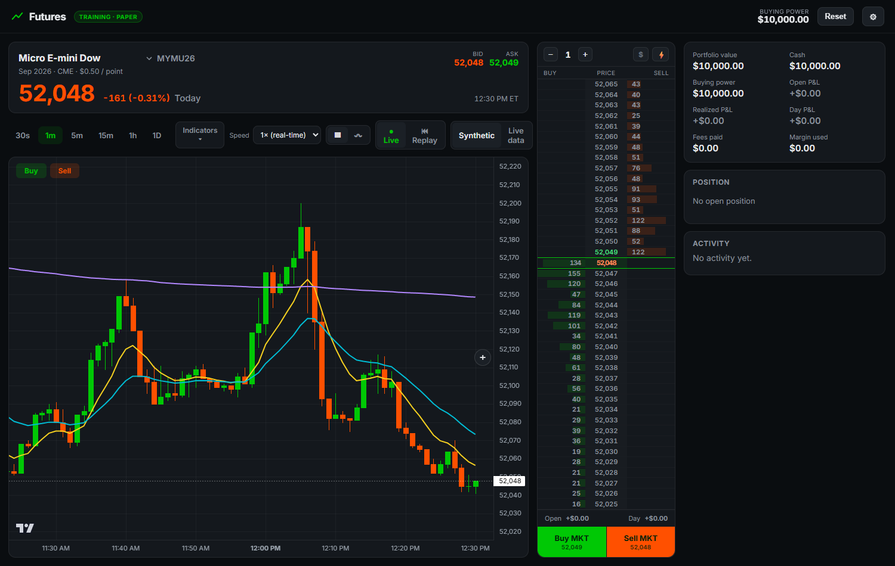
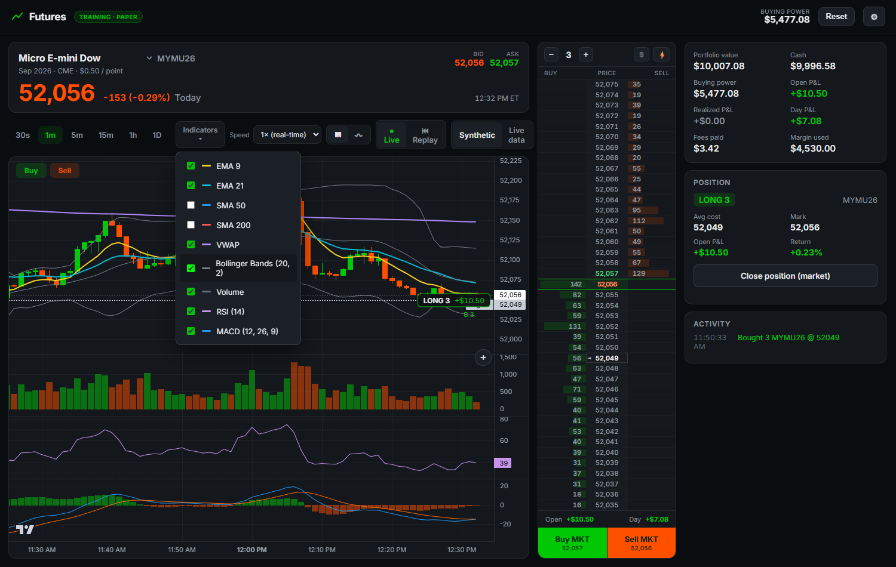
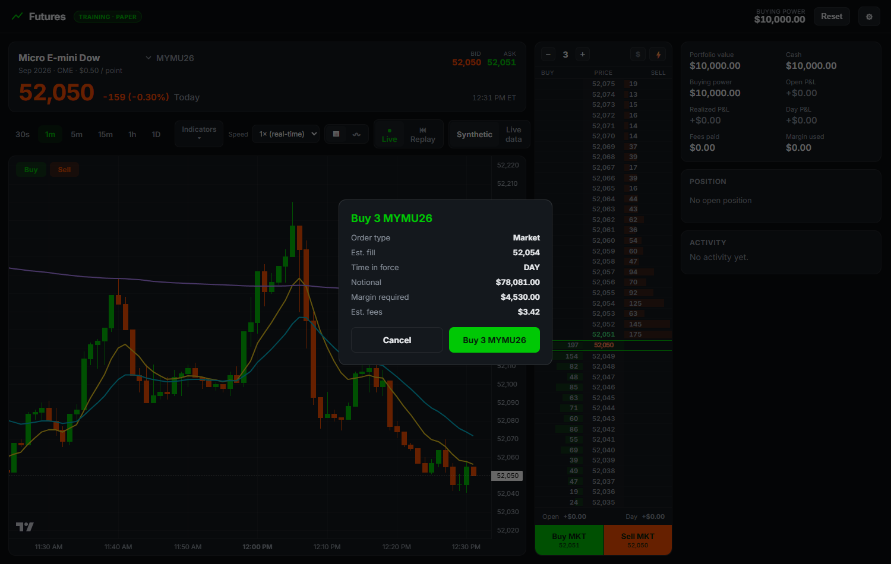

# Futures Training Simulator — MESU26

A Robinhood-Futures–style **paper trading simulator** for learning to trade futures.
It reproduces the Robinhood Legend futures chart and order flow using a synthetic or
replayed price feed. You start with **$10,000** in paper money, trading **MESU26**
(Micro E-mini S&P 500) by default — pick any of **20 contracts** from the header
dropdown, grouped by asset class:

| Class | Contracts |
|---|---|
| Equity index | MES · ES · MNQ · NQ · MYM · YM · M2K · RTY |
| Energy | MCL · CL · NG |
| Metals | MGC · GC · SI · HG |
| Rates | ZN · ZB |
| FX | 6E |
| Crypto | MBT |
| Agriculture | ZC |

Everything (P&L, margin, chart precision, the ladder's tick spacing) adapts to the
selected contract — from MNQ's $0.50 tick to CL's $10 and ZB's $31.25.

> 💡 The full-size contracts (ES, NQ, GC, SI…) need **$13k–$34k** of margin apiece,
> more than the default $10k account. Pick the micro version (MES, MNQ, MGC…) or
> raise your start balance in Settings — the app warns you when you select one you
> can't margin.

> ⚠️ **Training only.** No real orders are ever placed and no real money is involved.
> Prices are synthetically generated (or imported from a CSV you provide).

---

## Screenshots

**Main view** — live chart with EMA/VWAP overlays, the trading ladder (DOM)
down the middle, and the account panel on the right.



**Indicators & oscillators** — the Indicators menu (EMA 9/21, SMA 50/200, VWAP,
Bollinger Bands) plus the Volume / RSI / MACD sub-panes, shown with an open **LONG 3**
position: the on-chart position pill, the position card, and live P&L.



**Order confirmation** — with auto-send off (Robinhood's default), orders route to a
review screen showing type, estimated fill, time-in-force, notional, margin, and fees.



---

## Run it

### Download a prebuilt build (Windows)

Grab the latest **`FuturesTrainingSimulator-<ver>-win-x64.zip`** from the
[Releases page](https://github.com/johnhowelljr/FuturesTrainer/releases), unzip it,
and run the `.exe` inside — it self-extracts and launches, no install needed.

> The `.exe` is **not code-signed yet**, so Windows SmartScreen may show
> *"Windows protected your PC"* on first run — click **More info → Run anyway**.
> (The download is zipped specifically so the browser doesn't block it.)

### Desktop app (Electron) — recommended

```bash
cd rhfutures
npm install      # one-time (downloads Electron)
npm start        # launches the standalone desktop window
```

The app is fully self-contained — it serves its bundled files over a private
`app://` scheme (no browser, no dev server, no internet needed). Your account,
positions, and settings persist between launches via `localStorage`.

### Build a self-contained, movable executable

```bash
npm run portable   # -> "release/Futures Training Simulator <ver>.exe"  (single ~68 MB file)
npm run dist       # NSIS installer + portable .exe
```

`npm run portable` produces **one self-contained `.exe`** — copy that single file to any
Windows PC and run it; it self-extracts and launches with no install, no Node, no Electron.

> If `npm run portable` ever fails with *"Cannot create symbolic link … A required
> privilege is not held"*, enable **Settings → For developers → Developer Mode** (one
> toggle) and retry — that's electron-builder extracting its (macOS) code-signing tools.

A faster, always-current **folder** build lives at `release/FuturesTrainingSimulator/`
(kept in sync with the source automatically); run the `.exe` inside it for quick local use.

### Browser mode (optional, no Electron)

```bash
npm run serve    # zero-dependency static server on http://localhost:5173
```

---

## What it reproduces (Robinhood Legend futures)

**Chart**
- Candlestick **and** line/area modes, Robinhood green/red, ET time axis.
- Timeframes: 30s / 1m / 5m / 15m / 1h / 1D, crosshair with O/H/L/C readout.
- **Indicators** menu (lightweight-charts v5): overlays — EMA 9/21, SMA 50/200, **VWAP**,
  **Bollinger Bands**; oscillator sub-panes — **Volume**, **RSI (14)**, **MACD (12,26,9)**.
  Toggleable; EMA 9/21 + VWAP on by default.
- Live last-price line, bid/ask, day change & % with color.

**Ladder (DOM / depth) widget** — the primary Robinhood Legend trading surface
- Sits between the chart and the order form. **Buy column left, Sell column right.**
- **Select a price level → LMT and STP options appear there**; choosing one routes to
  the **order confirmation screen** (or sends immediately if ⚡ auto-send is on) — the
  documented Legend flow, not a one-click fire.
- Working orders show as **+N / −N LMT/STP** tags. **Hard-press and drag** a tag up or
  down to modify it (this **cancels and replaces** the order); click **✕** to cancel.
- Live **bid/ask depth bars** and your **position average** are drawn in-grid.
- **Buy MKT / Sell MKT** buttons place instant market orders.
- Header: quantity stepper + the **⚡ auto-send** toggle. The **$** button toggles the
  y-axis between **Price and P&L**. Footer shows **Open / Day P&L**. Quantity and
  auto-send stay in sync with the order ticket.

**On-chart trading** (matches Robinhood Legend)
- **Buy / Sell** icons (upper-left) load the order form's side.
- **Right-click anywhere on the chart** (or the **“+”** on the right axis) opens an order
  menu at that price: above the market → *Buy stop* / *Sell limit*; below → *Buy limit* /
  *Sell stop*.
- Working orders show draggable **LMT / STP** lines — drag to move (this **cancels and
  replaces** the order; you can't change type by dragging). Click the **✕** to cancel.
- A **position pill** at your average cost shows **quantity + live P&L**; drag it up or
  down to set a take-profit (limit) or stop for the open position.

**Order ticket**
- **Auto-send** toggle — **off by default** (Robinhood's default: orders go to a
  confirmation screen). On = send immediately.
- Order types: **Market, Limit, Stop** (the futures set Robinhood supports).
- **Time-in-force**: Day (GFD) or GTC. Day orders expire when the session rolls.
- Live estimated fill, notional, margin requirement, and fees.

**Account**
- Portfolio value, cash, buying power, open/realized/day P&L, fees paid, margin used.
- Position card with avg cost, mark, open P&L, return %, and one-click close.
- Working-orders list and an activity log of every fill/cancel/system event.

**Data source** (toolbar: Synthetic / Live data)
- **Synthetic** — the generated tape (mean-reverting, volatility clustering).
- **Live data** — **real, ~15-min-delayed** bars for the current day, pulled from
  Yahoo Finance's chart endpoint (`query1.finance.yahoo.com/v8/finance/chart/<symbol>`)
  and polled every 30s. Each contract maps to its continuous front-month symbol
  (`MES=F`, `CL=F`, `GC=F`, `ZN=F`, …). Fetched server-side and exposed to the page as
  `/__yahoo` — by `server.js` in browser mode, by the Electron main process in the
  packaged app — to avoid browser CORS. No API key. Educational use; unofficial
  endpoint; not real-time (real-time CME data carries exchange fees).
- Synthetic mode still uses this feed once at startup, to **anchor** the generated
  tape to the instrument's real current price instead of a stale hardcoded level.

**Synthetic feed modes**
- **Live** — an endless, generated tape that advances in real time.
- **Replay** — a full **daily feed** generated deterministically from the chosen date
  (seeded, so the same date always replays the same day). Play / pause / scrub /
  speed (1×–300×). Press **Space** to play/pause.
- **Import CSV** — load real historical bars (`time,open,high,low,close`) to replay
  an actual session.

---

## Accuracy / contract specs

Real exchange specs for all 20 contracts. **Point value** is the dollar move per
1.00 price point; **tick** is the minimum increment; **margin** is the initial
requirement per contract (maintenance runs ~91% of it).

| Root | Symbol | Name | Exch | Point value | Tick | Tick value | Initial margin |
|---|---|---|---|---|---|---|---|
| MES | MESU26 | Micro E-mini S&P 500 | CME | $5 | 0.25 | $1.25 | $2,455 |
| ES | ESU26 | E-mini S&P 500 | CME | $50 | 0.25 | $12.50 | $24,570 |
| MNQ | MNQU26 | Micro E-mini Nasdaq-100 | CME | $2 | 0.25 | $0.50 | $3,370 |
| NQ | NQU26 | E-mini Nasdaq-100 | CME | $20 | 0.25 | $5.00 | $33,685 |
| MYM | MYMU26 | Micro E-mini Dow | CBOT | $0.50 | 1.0 | $0.50 | $1,505 |
| YM | YMU26 | E-mini Dow | CBOT | $5 | 1.0 | $5.00 | $15,065 |
| M2K | M2KU26 | Micro E-mini Russell 2000 | CME | $5 | 0.10 | $0.50 | $935 |
| RTY | RTYU26 | E-mini Russell 2000 | CME | $50 | 0.10 | $5.00 | $9,365 |
| MCL | MCLU26 | Micro WTI Crude Oil | NYMEX | $100 | 0.01 | $1.00 | $820 |
| CL | CLU26 | WTI Crude Oil | NYMEX | $1,000 | 0.01 | $10.00 | $8,220 |
| NG | NGU26 | Natural Gas | NYMEX | $10,000 | 0.001 | $10.00 | $3,575 |
| MGC | MGCZ26 | Micro Gold | COMEX | $10 | 0.10 | $1.00 | $2,665 |
| GC | GCZ26 | Gold | COMEX | $100 | 0.10 | $10.00 | $26,640 |
| SI | SIU26 | Silver | COMEX | $5,000 | 0.005 | $25.00 | $32,500 |
| HG | HGU26 | Copper | COMEX | $25,000 | 0.0005 | $12.50 | $13,200 |
| ZN | ZNU26 | 10-Year T-Note | CBOT | $1,000 | ½/32 | $15.63 | $1,735 |
| ZB | ZBU26 | 30-Year T-Bond | CBOT | $1,000 | 1/32 | $31.25 | $4,350 |
| 6E | 6EU26 | Euro FX | CME | $125,000 | 0.00005 | $6.25 | $3,620 |
| MBT | MBTQ26 | Micro Bitcoin | CME | $0.10 | 5.0 | $0.50 | $2,530 |
| ZC | ZCZ26 | Corn | CBOT | $50 | 1/4¢ | $12.50 | $1,445 |

Notes:
- **Margins are modelled, not quoted.** Exchange margins change with volatility, so
  each spec carries a rough *percent of notional* for its product and the dollars are
  derived from it (`js/contract.js`). The model reproduces Robinhood's published micro
  figures to within rounding (MES $2,455/$2,232, MYM $1,510/$1,370, M2K $935/$850).
  All of it is editable in Settings.
- **Treasuries quote in 32nds**, the way the exchange does: ZB reads `108'26`
  (108 + 26/32) and ZN `108'195` (108 + 19½/32, the trailing digit being the half
  tick). The chart axis, ladder, order tickets, and activity log all use it, and
  the price fields accept `108'19`, `108-19`, `108'195` or a plain decimal.
- Grains quote in **cents per bushel** (481.25 = $4.8125/bu), so a "point" is one cent.
- Start prices and contract months were taken from the live feed on 2026-08-14; the
  app re-anchors to the real price on load anyway.

**Costs (Robinhood Futures defaults, all editable in Settings)**
- Commission **$0.75 / contract / side** — **$0.50 / side with Robinhood Gold**.
- CME exchange fee **$0.37 / side** + NFA fee **$0.02 / side**.
- Charged on **every** fill (round-trip = entry + exit).

**Margin**
- Per the table above; switching contracts loads that instrument's defaults.
- Optional auto-liquidation on a margin call.

**Math used**
- P&L: `(exit − entry) × point value × contracts × side`  (side = +1 long / −1 short).
- Fills: market buys at the **ask**, sells at the **bid** (1-tick spread by default).
- `equity = cash + unrealized P&L` · `buying power = equity − margin used`.
- Cash changes only by **realized P&L** and **fees** (futures post margin, not notional).

Keyboard: **B** / **S** set Buy/Sell, **Space** toggles replay play/pause.

---

## Project layout

```
index.html        markup / layout
styles.css        Robinhood dark theme
electron/main.cjs Electron main process (self-contained desktop app)
server.js         zero-dependency static server (browser mode)
vendor/           TradingView Lightweight Charts (vendored, MIT)
js/
  contract.js     the 20 contract specs, fees, margin, formatting
  rng.js          seeded PRNG (reproducible feeds)
  feed.js         synthetic generator, live ticker, replay, CSV import
  engine.js       orders, fills, positions, P&L, costs, margin
  ladder.js       Ladder / DOM widget (click price levels to trade)
  charttrade.js   on-chart order entry (Buy/Sell icons, draggable lines, pill)
  orderticket.js  Robinhood-style floating order ticket
  chart.js        Lightweight Charts wrapper (candles/line, markers, lines)
  ui.js           DOM rendering
  store.js        localStorage persistence
  app.js          wiring / bootstrap
```

Reset the paper account anytime with the **Reset** button (top-right).
Adjust fees, margin, volatility, start price, and Gold status in **Settings (⚙)**.
